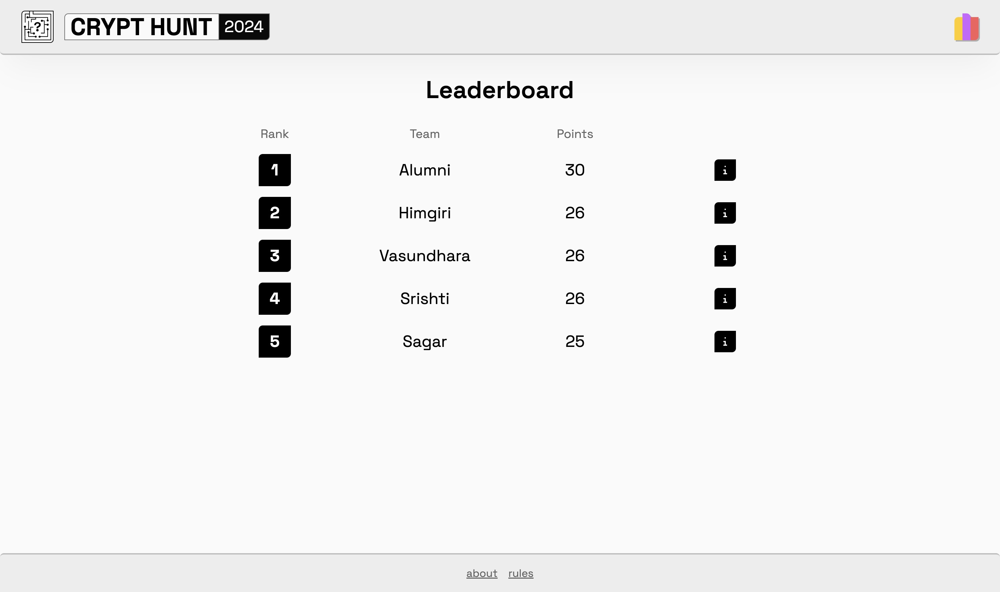
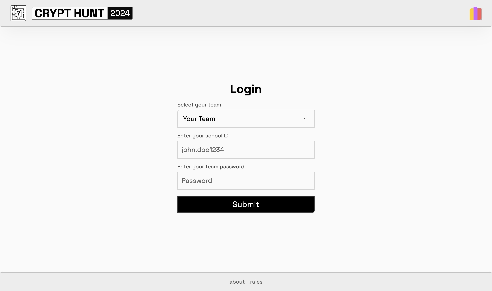

# TSRS Crypt Hunt 2024 - Online scavenger Hunt

Astro, Tailwind and Turso based platform for the TSRS Crypt Hunt 2024 - an online intraschool competitive scavenger hunt.

### Streamlined player experience


<p style="text-align: center">
  
   
</p>

### Customized admin dashboard


## Development

### Prerequisites
- Node.js
- NPM/Bun package manager
- Turso CLI
- Flux ID and API key (https://flux.vsahni.me)

Once you have the prerequisites installed, clone the repository and navigate to the project directory.

Follow the steps below before running the project:

1. Install the dependencies:
```bash
bun install
```
1. Create a `.env` file in the root directory and add the environment variables as shown in the `.env.example` file. You need to have a Turso database set up and the Flux API key to run the project. Use their respective documentation to set up the database and get the API key.
2. Push Drizzle migrations:
```bash
bunx drizzle-kit push:sqlite
```
3. Run the project:
```bash
bun run dev
```

By default, the project runs on `localhost:4321` - Astro will inform you of the port when you run the project.

**Note:** When making schema changes, you need to push the migrations again to reflect the changes in the database. Be careful when pushing migrations as it may reset certain database columns.

## Deployment

This project was designed to be deployed on Cloudflare Pages. Please refer to the Cloudflare Pages documentation to deploy the project.

## CLI

Take a look at the CLI which has many helper commands to manage the event.

``
bun run db --help
``


